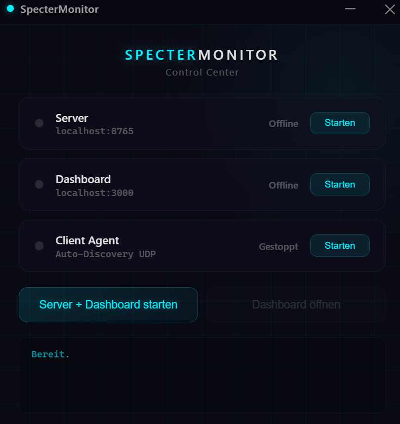
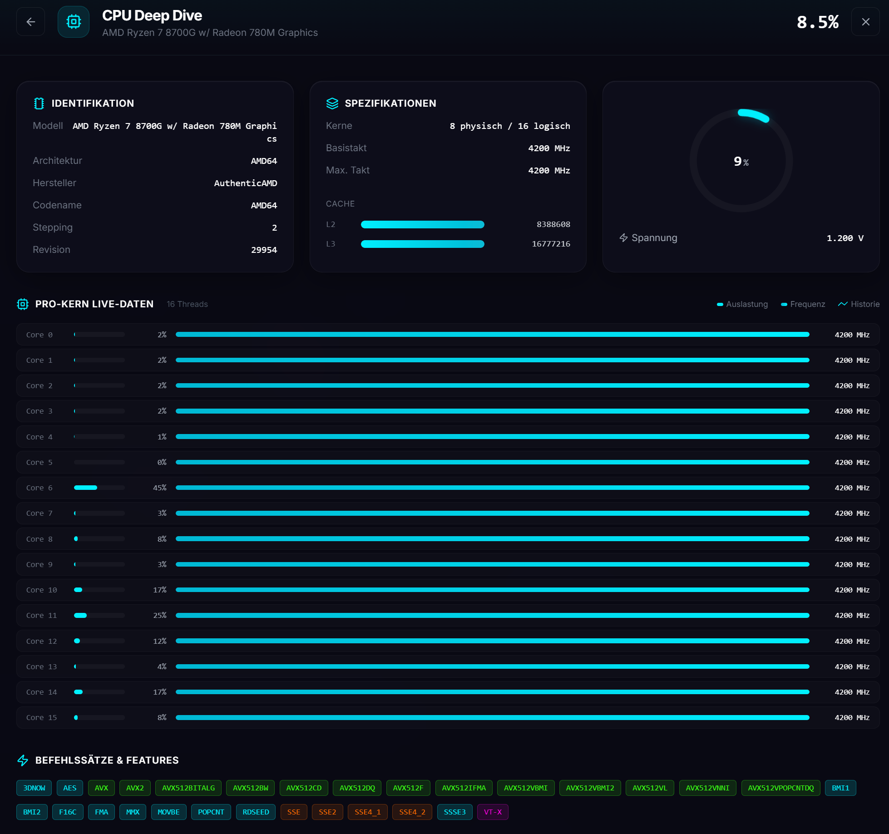
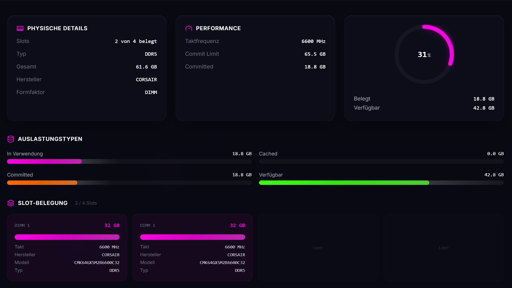

<p align="center">
  
</p>

<h1 align="center">SpecterMonitor</h1>

<p align="center">
  <strong>Real-time hardware monitoring & remote management for your entire home network.</strong><br/>
  <sub>Neon Dark Theme · Buttery-smooth Animations</sub>
</p>

<br/>

<p align="center">
  
  
  
  
  
  
  
  
</p>

<br/>

<p align="center">
  
</p>

<br/>

---

<br/>

## What is this?

**SpecterMonitor** is a high-performance hardware dashboard that monitors every PC on your local network in real time. Built with a Python backend (FastAPI + WebSocket streaming) and a Next.js frontend featuring glassmorphism design and spring-based animations.

> Imagine: Windows Task Manager meets Grafana and they take some Pills so you can Monitor your Maschines localy so you dont have to run to see whats going on.

<br/>

## Features

### SpecterMonitor Control Service | Finally Here !

<p align="center">
  
</p>


### CPU Deep-Dive

Click the CPU card and an animated overlay expands with spring physics into fullscreen mode:

- **Identification** — Model name, architecture, vendor, codename, stepping
- **Specifications** — TDP, base clock, max boost, L1/L2/L3 cache with visual progress bars
- **Live Per-Core Monitoring** — Each core with real-time usage bars, current frequency, and mini sparkline graphs
- **Temperature & Voltage** — Vcore and temperature live from WMI/sensor data
- **Instruction Set Badges** — Color-coded tags for AVX, SSE, VT-x, AES-NI and more

<p align="center">
  
</p>


### RAM Deep-Dive

Click the RAM card for the physical memory view:

- **Slot Allocation** — Visualization of each DIMM slot with capacity, clock speed, manufacturer, and part number
- **Live Usage Bars** — In Use, Cached, Committed, Available — each as an animated gradient bar
- **Performance Details** — DDR type, clock speed, CAS latency, commit limit
- **Empty Slots** — Shown with dashed borders so you can see upgrade potential at a glance

<p align="center">
  
</p>

### App Monitoring & Task Kill

- **Full Process List** — Sortable by CPU%, RAM, Disk I/O
- **App Icons** — Automatically extracted `.exe` icons as base64 PNGs
- **Remote Kill** — Terminate processes on any connected PC directly from the dashboard
- **Multi-Host Support** — Monitor multiple PCs simultaneously via agent connections

### More Highlights

| Feature | Description |
|---|---|
| **WebSocket Streaming** | ~1s update interval, no polling, no lag |
| **On-Demand Connections** | Deep-dive data only streams when the overlay is open |
| **Recharts Graphs** | CPU/RAM history, GPU load, temperatures |
| **Temperature Monitoring** | CPU & GPU temp via WMI / sensor readouts |
| **Network Rates** | Live upload/download in KB/s or MB/s |
| **Disk Overview** | All partitions with usage and free space |

<br/>

---

<br/>

## Roadmap — Coming Soon

> Features currently in development or planned for future releases.

| Status | Feature | Description |
|:---:|---|---|
| 📃 | **Remote Desktop** | View and control a remote PC's screen live in the browser — like TeamViewer, but local on your own network. Low-latency via WebSocket + WebRTC. |
| 🛠️ | **GPU Deep-Dive** | Detailed view for graphics cards: VRAM usage, shader clock, fan speed, power draw, driver version, and temperature history. |
| 📃 | **Disk Deep-Dive** | S.M.A.R.T. data, read/write rates per partition, SSD health, NVMe temperature, and wear level. |
| 📃 | **Alert System** | Configurable thresholds (CPU > 95%, RAM > 90%, Temp > 85C) with desktop notifications and optional Discord/Telegram webhook. |
| 📃 | **Remote File Manager** | Browse, upload/download, and manage files on connected PCs — directly from the dashboard. |
| 📃 | **Docker Monitoring** | Container status, per-container resource usage, logs, and start/stop/restart directly in the dashboard. |
| 📃 | **Metric History & Export** | Long-term recording of all metrics in SQLite/InfluxDB with CSV/JSON export and historical graphs over days/weeks. |
| 📃 | **Wake-on-LAN** | Wake PCs on the network from the dashboard — magic packet with one click. |
| 📃 | **Authentication** | Login system with password protection so not everyone on the network can access the dashboard. |
| 📃 | **Mobile Layout** | Responsive display for smartphones and tablets with touch-optimized gestures. |
| ✅ | **SpecterMonitor Control Service** | Windows Desktop App built with Electron — manages Server, Dashboard & Client all in one with auto-updater |

> ✅ = Released | 🛠️ = In Work | 📃 = Planned

<br/>

---

<br/>

## Installation & Setup

### Desktop App (Recommended)

Download the installer — that's it. No Python, no Node.js, no manual setup required.

1. Go to [**Releases**](https://github.com/Mou67/SpecterMonitor/releases/latest)
2. Download `SpecterMonitor Setup x.x.x.exe`
3. Run the installer
4. Launch SpecterMonitor from the desktop shortcut

The app manages everything automatically (server, dashboard, updates). Future updates are installed automatically in the background.

<br/>

### Connect Remote PCs

On each additional PC you want to monitor, run the lightweight Python agent:

```bash
cd client
pip install -r requirements.txt
python agent.py
```

The agent auto-discovers the server on your network and starts streaming metrics immediately.

<br/>

### Access from your entire home network

The dashboard listens on **all network interfaces** (`0.0.0.0:3000`). Accessible from any device on the same network:

```
http://<host-pc-ip>:3000
```

<br/>

---

### Developer Setup (Manual)

> Only needed if you want to run from source or contribute.

**Prerequisites:** Python 3.10+, Node.js 18+, Windows recommended

```bash
# Server
cd server
pip install -r requirements.txt
python main.py

# Dashboard (separate terminal)
cd dashboard
npm install
npm run dev
```

Open `http://localhost:3000`

<br/>

---

<br/>

## Project Structure

```
├── server/
│   ├── main.py              # FastAPI server & WebSocket endpoints
│   ├── monitor.py           # Hardware data collection (CPU, RAM, GPU, Disk, Network)
│   ├── models.py            # Pydantic data models
│   ├── discovery.py         # UDP beacon for auto-discovery
│   └── requirements.txt
│
├── client/
│   ├── agent.py             # Remote agent for additional PCs
│   ├── discovery.py         # UDP beacon for auto-discovery
│   └── requirements.txt
│
├── dashboard/
│   ├── app/                 # Next.js App Router
│   ├── components/
│   │   ├── CpuCard.tsx          # CPU overview card (clickable)
│   │   ├── CpuDetailOverlay.tsx # CPU deep-dive modal
│   │   ├── RamCard.tsx          # RAM overview card (clickable)
│   │   ├── RamDetailOverlay.tsx # RAM deep-dive modal
│   │   ├── GpuCard.tsx          # GPU metrics
│   │   ├── NetworkCard.tsx      # Network up/down
│   │   ├── DiskCard.tsx         # Disk usage
│   │   ├── ProcessTable.tsx     # Process list + kill
│   │   ├── CoreGrid.tsx         # CPU core grid
│   │   ├── MetricChart.tsx      # Recharts time-series graphs
│   │   ├── ProgressRing.tsx     # Animated SVG ring
│   │   ├── AnimatedValue.tsx    # Smooth number transitions
│   │   └── HostDetail.tsx       # Host overview with tabs
│   ├── hooks/
│   │   ├── useWebSocket.ts          # Main WebSocket
│   │   ├── useCpuDetailWebSocket.ts # CPU detail (on-demand)
│   │   └── useRamDetailWebSocket.ts # RAM detail (on-demand)
│   ├── types/
│   │   └── metrics.ts           # TypeScript interfaces
│   └── package.json
│
└── Readme/
    ├── Images/
    │   ├── Image_1.png          # CPU deep-dive screenshot
    │   └── Image_2.png          # RAM deep-dive screenshot
    └── gifs/
        └── video_1.gif          # Demo GIF
```

<br/>

---

<br/>

<p align="center">
  <sub>Built with coffee and late nights.</sub><br/>
  <sub><strong>SpecterMonitor</strong> — Your network, your dashboard.</sub>
</p>
